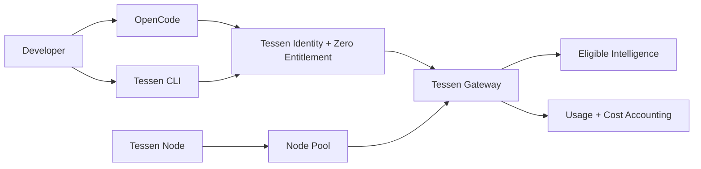

<p align="center">
  
</p>

<h1 align="center">Project Zero</h1>

<p align="center">
  <strong>Free coding intelligence for developers.</strong><br/>
  A developer preview from Tessen, built around a growing pool of developers, tools and distributed compute.
</p>

<p align="center"><strong>THE ZERO POOL IS COMING.</strong></p>

<p align="center">
  <a href="https://tessen.ai">Tessen</a> ·
  <a href="./docs/PROJECT_ZERO.md">Project Zero</a> ·
  <a href="./docs/NODE.md">Node Pool</a> ·
  <a href="./docs/OPENCODE.md">OpenCode</a> ·
  <a href="./docs/CLI.md">CLI</a> ·
  <a href="./docs/FAQ.md">FAQ</a>
</p>

---

## What is Project Zero?

Project Zero is Tessen's **free developer intelligence preview**.

We're building a simple path for developers to bring Tessen into real coding work — starting with **OpenCode** and the **Tessen CLI** — while a growing **Node Pool** expands the network behind it.

The idea is straightforward:

```text
MORE DEVELOPERS  →  MORE USEFUL DEMAND
                         ↓
MORE INTELLIGENCE ←  MORE NODES
```

Project Zero is the first public developer program built around that loop.

**$0 to start during the preview.** Access will still be metered and protected by fair-use, capacity, reliability and abuse controls. Free does not mean unlimited.

> Project Zero is in pre-launch certification. This repository intentionally does not publish install commands, credentials, node counts, developer counts or capacity figures until those paths and numbers are real.

## The developer path

When the Zero Pool opens, the intended experience is:

```text
Discover Project Zero
        ↓
Sign in to Tessen
        ↓
Enter the developer Console
        ↓
Connect OpenCode or Tessen CLI
        ↓
Use tessen/project-zero
        ↓
Complete a real coding task
        ↓
Optionally run Tessen Node
```

The canonical developer-facing model reference is:

```text
tessen/project-zero
```

Internal routing can evolve without changing that public identity.

## Built for where developers work

| Surface | Role in Project Zero | Status |
| --- | --- | --- |
| **OpenCode** | Use Project Zero in an agentic coding workflow | Preparing launch |
| **Tessen CLI** | Terminal-native Tessen | Preparing launch |
| **Tessen Platform** | Public developer discovery and documentation | Preparing launch |
| **Tessen Console** | Developer identity, credentials, usage and controls | Preparing launch |
| **Tessen Node** | Contribute available compute under explicit controls | Preparing launch |
| **Tessen Status** | Public operational transparency | Preparing launch |

No placeholder command in this repository should be mistaken for a released product. When a surface is certified and public, its exact onboarding instructions will replace the status above.

## The Zero Pool

Project Zero is designed around two sides of one network.

### Developers create useful demand

Developers should be able to use Tessen for actual coding work instead of watching a demo or reading a benchmark.

### Nodes grow available capacity

Tessen Node is being built as the participation layer for distributed compute. A Node should understand what a machine can safely contribute, keep participation explicit, and report only real server-authoritative state where accounting is involved.

### Tessen coordinates the network

Identity, entitlements, routing, accounting, reliability controls and operational safety remain coordinated by Tessen.

Read **[Node and the Zero Pool](./docs/NODE.md)**.

## What makes Zero different?

Our launch standard is a clean new developer completing a **real coding request** without founder intervention.

The preview is being prepared around:

- one Tessen developer identity;
- a real Project Zero entitlement;
- real request routing through Tessen;
- real usage and underlying cost accounting;
- OpenCode and terminal-native access;
- explicit rate, concurrency and abuse controls;
- operational kill switches;
- honest status and failure states;
- optional Node participation;
- no simulated traction or capacity.

## 100,000 developers

Our long-term acquisition ambition for Project Zero is:

> **100,000 activated developers.**

That is a **target, not a current-user claim**.

An activated developer is more meaningful than a registration. We care about discovery → first successful request → useful repeat usage.

```text
Visitors
  ↓
Developer sign-ins
  ↓
Zero activations
  ↓
First successful requests
  ↓
Returning developers
  ↓
Node installs
  ↓
Active participating Nodes
```

If we publish network statistics, they will come from production telemetry.

## Principles

**Real work over demos.** Zero should be useful in an actual repository.

**Truth over vanity metrics.** No invented developer counts, node counts, uptime or capacity.

**One identity.** Platform, Console and developer tools converge on Tessen identity.

**Free is still accountable.** A $0 developer price does not remove usage, cost or abuse accounting.

**Explicit Node control.** Running a Node remains visible and controllable by the person operating the machine.

**Stable public interface.** Developers use `tessen/project-zero`; eligible routing can evolve behind it.

**Operational transparency.** Availability and incidents belong on a real status surface.

## Architecture at a glance



This is a public conceptual model, not a disclosure of Tessen's private production topology. See **[Architecture](./docs/ARCHITECTURE.md)**.

## Documentation

| Guide | What it covers |
| --- | --- |
| **[Project Zero](./docs/PROJECT_ZERO.md)** | Program model, activation and public contract |
| **[Node Pool](./docs/NODE.md)** | Distributed compute vision and participation principles |
| **[OpenCode](./docs/OPENCODE.md)** | Planned OpenCode experience and model reference |
| **[Tessen CLI](./docs/CLI.md)** | Terminal experience and launch contract |
| **[Developer Alpha](./docs/DEVELOPER_ALPHA.md)** | Launch standard and activation funnel |
| **[Architecture](./docs/ARCHITECTURE.md)** | Public surface and request-flow architecture |
| **[Roadmap](./docs/ROADMAP.md)** | What must be true before the pool opens |
| **[FAQ](./docs/FAQ.md)** | Straight answers about the preview |
| **[Security](./SECURITY.md)** | Responsible vulnerability reporting |

## Coming → Open

Today:

> **THE ZERO POOL IS COMING.**

When the clean developer path is certified:

> **THE ZERO POOL IS OPEN.**

The README will then lead with real install/onboarding instructions instead of promises.

## Follow Project Zero

Watch or star this repository to follow the public launch.

Project Zero is being built by **Tessen**.

**More developers. More nodes. More intelligence.**
