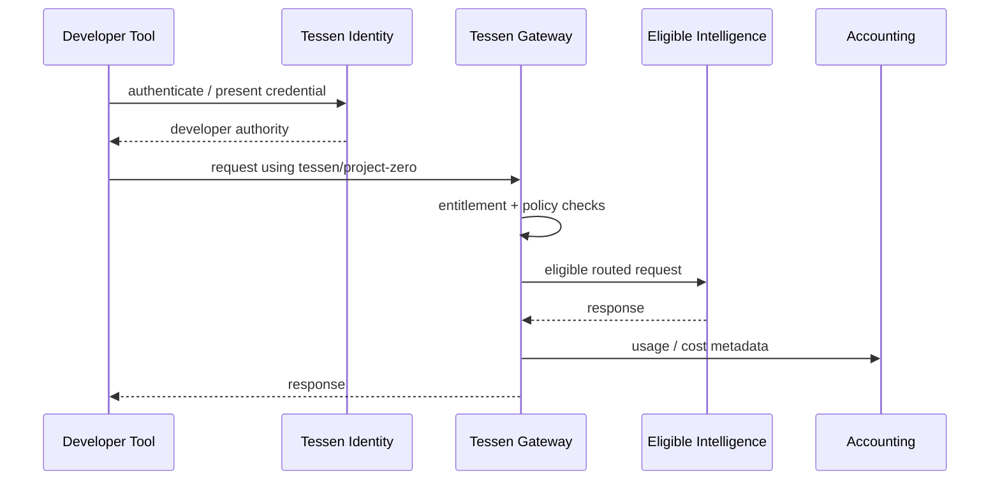

# Public Developer Architecture

This document describes public responsibilities, not Tessen's private production topology.

## Surfaces

### tessen.ai

Primary Tessen product.

### tessen.ai/company

Company and system story.

### platform.tessen.ai

Public developer website: API, Code, Connect, Project Zero, Node and documentation discovery.

### console.tessen.ai

Authenticated developer workspace: overview, credentials, usage and developer controls.

### status.tessen.ai

Independent public operational status for customer-facing Tessen systems.

## Identity

The intended experience is one Tessen identity across developer surfaces. Sessions can remain host-scoped; sharing an identity does not require one broad cross-subdomain cookie.

## Project Zero request path

## Zero controls

A sustainable $0 preview still requires:

- authentication;
- entitlement checks;
- rate and concurrency controls;
- usage and underlying cost accounting;
- abuse controls;
- provider/route health;
- operational kill switches.

## Node boundary

Node is a participation surface, not an implicit extension of a developer session. Participation and local execution remain explicit.
