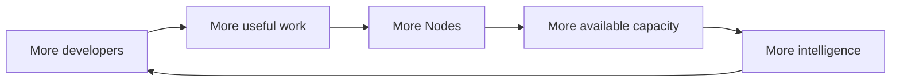

# Node and the Zero Pool

Tessen Node is the desktop participation layer for Tessen's distributed compute direction.

Project Zero creates useful developer demand. The Zero Pool is planned to begin with **100 trillion (100T) shared tokens per day**, replenished every day at **00:00 UTC**. Node is intended to let participating machines contribute available compute under explicit user controls and help grow the network beyond its starting pool. At each **00:00 UTC** reset, verified available capacity can be reflected in the next day's displayed ZERO Pool, so real Node growth can translate into a larger pool.

## Grow tomorrow's Zero Pool

The planned launch baseline is **100T shared tokens per day**.

Node creates a direct participation loop:

```text
DEVELOPERS JOIN ZERO
        ↓
SOME OPT IN TO TESSEN NODE
        ↓
VERIFIED NODE CAPACITY GROWS
        ↓
NEXT DAY'S ZERO POOL CAN INCREASE
        ↓
MORE FREE INTELLIGENCE FOR DEVELOPERS
```

At **00:00 UTC**, Tessen can publish the next daily pool amount using capacity that has actually been verified. More accounts do not automatically mean more capacity: growth comes from Nodes that are installed, eligible, opted in, available and actually useful to the network.

## The network loop



## Local · Private · Earn

### Local

Node should understand the machine it is running on and what supported workloads it can safely execute.

Where compatible open-weight models are already present, future Node capability can detect supported local capacity rather than blindly requiring duplicate downloads.

Detection must not mean automatic execution.

### Private

Participation should have explicit boundaries around local data, credentials, models and workloads. A developer should be able to see whether Node is participating and pause it.

### Earn

Where participation benefits or credits are enabled, accounting must come from real contributed work and server-authoritative records. Running Node is intended to let developers benefit from contributing useful capacity as well as help strengthen the Zero Pool. The public preview must not imply guaranteed earnings or a fixed return.

## What Node is not

Node is not permission for Tessen to silently use a machine.

Node is not a claim that every model can run on every computer.

Node is not a promise that community capacity will always be available.

Node is not a fabricated network counter.

## Public metrics

Once backed by production telemetry, useful network metrics may include:

- active participating Nodes;
- supported capacity classes;
- successful work served;
- reliability;
- aggregate availability.

Until then, this repository describes the direction without pretending the network is larger than it is.

## Status

**Preparing developer release.**

Public installers, requirements and supported-platform details will appear only after the distributable Node build is certified.
