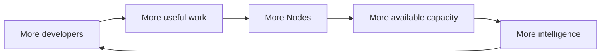

# Node and the Zero Pool

Tessen Node is the desktop participation layer for Tessen's distributed compute direction.

Project Zero creates useful developer demand. Node is intended to let participating machines contribute available compute under explicit user controls.

## The network loop

## Local · Private · Earn

### Local

Node should understand the machine it is running on and what supported workloads it can safely execute.

Where compatible open-weight models are already present, future Node capability can detect supported local capacity rather than blindly requiring duplicate downloads.

Detection must not mean automatic execution.

### Private

Participation should have explicit boundaries around local data, credentials, models and workloads. A developer should be able to see whether Node is participating and pause it.

### Earn

Where economic participation is enabled, accounting must come from real contributed work and server-authoritative records. The public preview must not imply guaranteed earnings.

## What Node is not

Node is not permission for Tessen to silently use a machine.

Node is not a claim that every model can run on every computer.

Node is not a promise that community capacity will always be available.

Node is not a fabricated network counter.

## Public metrics

Once backed by production telemetry, useful network metrics may include:

- active participating Nodes;
- supported capacity classes;
- successful work served;
- reliability;
- aggregate availability.

Until then, this repository describes the direction without pretending the network is larger than it is.

## Status

**Preparing developer release.**

Public installers, requirements and supported-platform details will appear only after the distributable Node build is certified.
