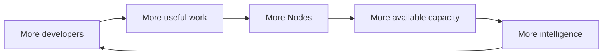

# Node and the Zero Pool

Tessen Node is the participation layer for Tessen's distributed compute direction.

Project Zero creates useful developer demand. The Zero Pool is planned to begin with **100 trillion (100T) shared tokens per day**, replenished every day at **00:00 UTC**. Node is intended to let participating machines contribute available compute under explicit user controls and help grow the network beyond its starting pool. At each **00:00 UTC** reset, verified available capacity can be reflected in the next day's displayed ZERO Pool, so real Node growth can translate into a larger pool.

## Minimum requirements

The following are **initial target requirements for the public Node program**, not a certification that every configuration at these limits has already been tested.

### Windows desktop Node

- Windows 10/11 64-bit
- Modern x64 CPU
- 2+ CPU cores recommended
- 4 GB RAM recommended
- At least 5 GB free disk space
- Internet connection with outbound HTTPS
- Tessen account and Node authorization

The native Windows Node includes its own Node.js runtime; users do not need to install Node.js or npm separately.

### Linux server / cloud Node

The headless server path is designed for infrastructure where no graphical desktop is available.

**Initial target:**

- Ubuntu 22.04 LTS or newer
- x86_64 initially; additional architectures may follow certification
- 2+ vCPU
- 4 GB RAM
- At least 5 GB free disk space
- Stable outbound HTTPS connectivity
- SSH/command-line access for installation and administration
- No desktop environment required

A Linux server can therefore run Tessen Node entirely from the command line.

### Optional GPU

A GPU is **not required for a basic Node**. Compatible CPU capacity can participate where the assigned workload supports it.

GPU participation depends on the hardware, drivers, runtime and workload. Node is expected to discover supported local capabilities rather than claiming that every model or workload can run on every machine.

### Hosting providers and cloud infrastructure

Tessen Node is intended to support a future infrastructure-partner path for:

- cloud hosting companies;
- VPS providers;
- dedicated-server providers;
- GPU infrastructure providers;
- data-center operators;
- developers running their own servers.

A provider can eventually install a **headless Node** on eligible infrastructure and explicitly opt that capacity into the Tessen network.

The provider should not need to maintain a graphical desktop session.

## Developer machines and OpenCode

Node is not only for contributing capacity to the public network.

A developer can also use Node as the local hardware/runtime layer while developing with Tessen Code and supported OpenCode workflows. The Node can report the machine's available capabilities so the authorized Tessen software can understand what the developer's computer can provide.

The intended boundary is:

```
Developer
   ↓
Tessen Code / OpenCode
   ↓
Tessen Node
   ↓
Local hardware + supported runtimes
```

Node capability discovery is local to the machine. **Detection does not mean automatic execution or automatic participation.** Workload execution remains subject to Tessen authorization and the user's explicit participation controls.

## Run Node where compute already lives

The public Node direction covers both personal computers and headless infrastructure:

- **Windows** — native desktop Node;
- **macOS** — native desktop Node;
- **Linux** — supported desktop/native Node distribution;
- **Cloud and servers** — a headless command-line/service path for compatible Linux servers, VMs and cloud compute.

These are launch targets, not a claim that every installer or server path is already publicly available. Exact installation commands, packages, supported architectures and requirements will be published only after each distributable path is certified.

Desktop and headless Nodes are intended to participate in the same Tessen network contract: Tessen identity, Node registration, explicit participation controls, capability reporting, workload authority, receipts/accounting, and pause or disable controls. A headless server does not need the desktop tray interface.

## Grow tomorrow's Zero Pool

The planned launch baseline is **100T shared tokens per day**.

Node creates a direct participation loop:

```text
DEVELOPERS JOIN ZERO
        ↓
SOME OPT IN TO TESSEN NODE
        ↓
VERIFIED NODE CAPACITY GROWS
        ↓
NEXT DAY'S ZERO POOL CAN INCREASE
        ↓
MORE FREE INTELLIGENCE FOR DEVELOPERS
```

At **00:00 UTC**, Tessen can publish the next daily pool amount using capacity that has actually been verified. More accounts do not automatically mean more capacity: growth comes from Nodes that are installed, eligible, opted in, available and actually useful to the network.

## The network loop



## Local · Private · Earn

### Local

Node should understand the machine it is running on and what supported workloads it can safely execute.

Where compatible open-weight models are already present, future Node capability can detect supported local capacity rather than blindly requiring duplicate downloads.

Detection must not mean automatic execution.

### Private

Participation should have explicit boundaries around local data, credentials, models and workloads. A developer should be able to see whether Node is participating and pause it.

### Earn

Where participation benefits or credits are enabled, accounting must come from real contributed work and server-authoritative records. Running Node is intended to let developers benefit from contributing useful capacity as well as help strengthen the Zero Pool. The public preview must not imply guaranteed earnings or a fixed return.

## What Node is not

Node is not permission for Tessen to silently use a machine.

Node is not a claim that every model can run on every computer.

Node is not a promise that community capacity will always be available.

Node is not a fabricated network counter.

## Public metrics

Once backed by production telemetry, useful network metrics may include:

- active participating Nodes;
- supported capacity classes;
- successful work served;
- reliability;
- aggregate availability.

Until then, this repository describes the direction without pretending the network is larger than it is.

## Release gate

Before a platform is presented as publicly installable, its real distribution path should be certified end to end: install, authenticate, register, report capabilities, participate only with explicit permission, pause/disable correctly, produce authoritative work receipts/accounting when work is assigned, survive supported restart behavior, and disconnect/uninstall cleanly.

The same standard applies to the headless cloud/server path.

## Status

**Preparing developer release.**

Public installers, command-line installation instructions, requirements and supported-platform details will appear only after the corresponding distributable Node paths are certified.
